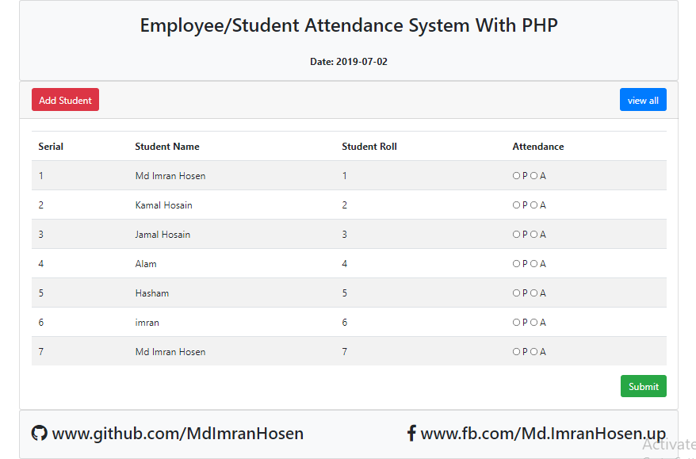
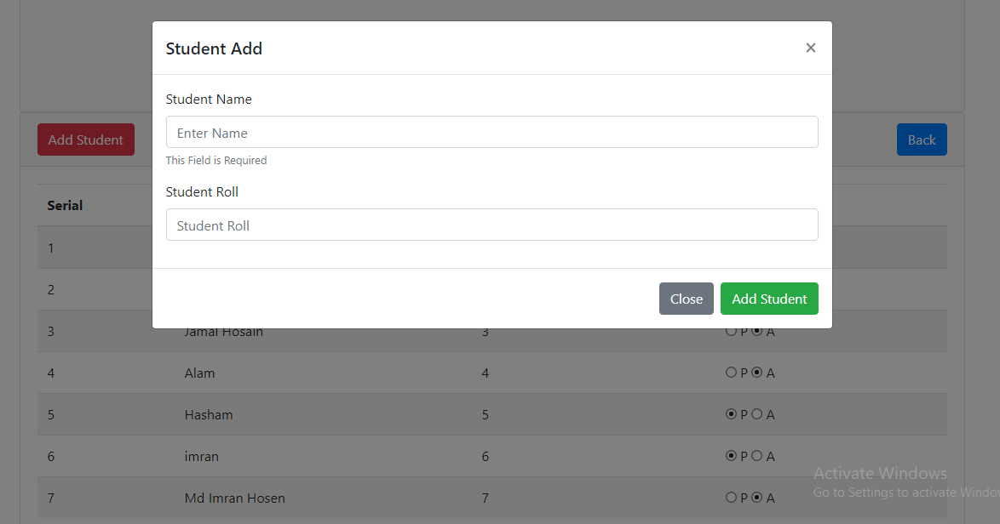
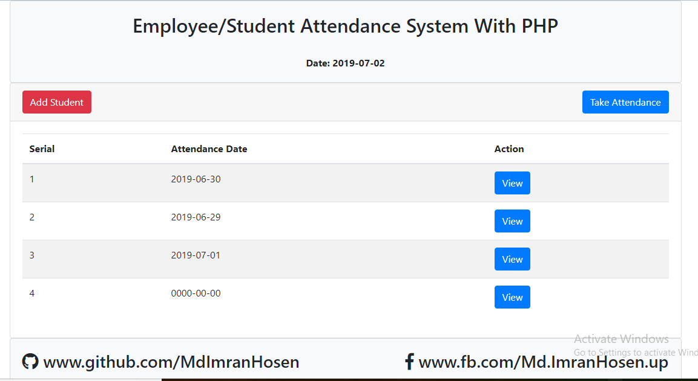

# Student-Attendance-System
Employee/Student Attendance System With PHP, Bootstrap, Jquery

<strong>Student Add, Student Date by Attendace, Date by Student Attendace List View, Attendace Date by Update.</strong>

<h1>Home Page</h1>

 
<h1>Add Student Modal</h1>

 
<h1>All Attendace Date List</h1>

